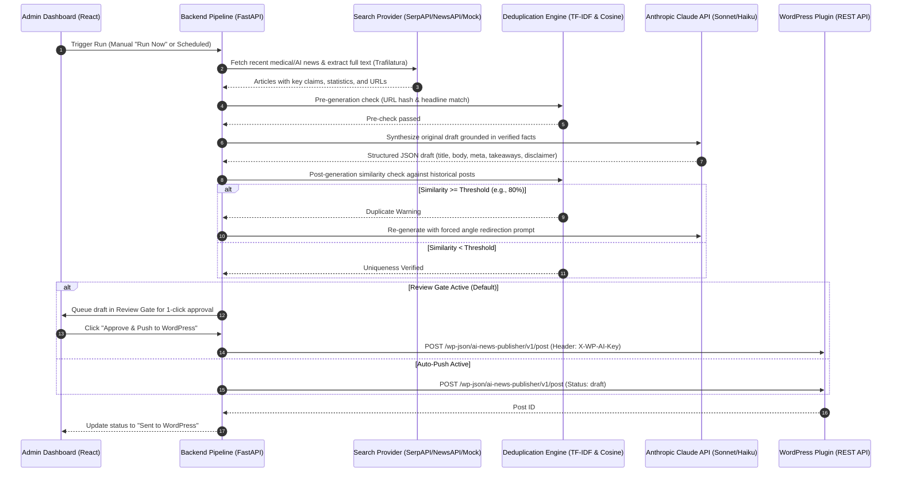

# AI-Powered Medical/AI News Research & WordPress Auto-Publisher

A full-stack, enterprise-grade automated publishing system that searches recent medical and AI news, grounds unique article drafts via **Anthropic Claude**, performs strict pre- and post-generation deduplication, and pushes draft posts directly to WordPress with rich SEO metadata and editorial source citations.

---

## Architecture & End-to-End Data Flow



---

## Key Features

1. **Pluggable News Research Engine**:
   - Adapters for **SerpAPI** (Google News), **NewsAPI.org**, **Bing Web Search**, and a **Mock Sandbox Provider** for offline/test runs.
   - Robust article body text extraction with `trafilatura` and fallback to `BeautifulSoup`.
   - Strict `robots.txt` checking for compliant web extraction.
   - Automated extraction of statistical claims, sample sizes, trial phases, and quotes.

2. **Guaranteed Uniqueness & Deduplication**:
   - **Pre-generation check**: Instant URL hash index check and title fuzzy match (>85%) against prior coverage.
   - **Post-generation check**: Composite TF-IDF n-gram vector cosine similarity + sequence ratio comparison against **all historical posts**.
   - **Self-Healing Angle Shift**: If similarity exceeds the configurable threshold (default 80%), Claude is automatically re-prompted with an explicit pivot directive.

3. **Grounded AI Generation (Anthropic Claude)**:
   - Zero-hallucination constraint: strictly grounded in research source excerpts.
   - Configurable tone (Clinical, Professional, Conversational, Investigative).
   - Word count target sliders (300 to 3,000 words).
   - Structured components: Key Takeaways callout box, FAQ section, Medical Legal Disclaimer box, pull quotes, and sources table.
   - SEO metadata generation: Keyword-rich slug, Meta Title (<60 chars), Meta Description (<155 chars).

4. **WordPress Custom Plugin (`wp-plugin/ai-news-publisher`)**:
   - Exposes secure custom endpoint `POST /wp-json/ai-news-publisher/v1/post`.
   - Authenticated via `X-WP-AI-Key` header.
   - **Forced Draft Policy**: Posts are always inserted with `post_status => 'draft'` (never published live without human editorial sign-off).
   - Compatible with **Yoast SEO** (`_yoast_wpseo_title`, `_yoast_wpseo_metadesc`) and **Rank Math** (`rank_math_title`, `rank_math_description`).
   - Custom editorial meta box on post edit screen displaying original sources and key claims.
   - Admin settings page with API key regeneration, connection diagnostics, and incoming draft audit logs.
   - Ready-to-install `.zip` bundle created via `package-plugin.sh`.

5. **Modern Admin Dashboard (React + Vite)**:
   - **Topic Manager**: Add/edit/delete topics, weight priorities, lookback windows, domain whitelists/blocklists, and bulk paste parser.
   - **Content Rules & SEO Studio**: Live configuration of editorial voice, word count, structural modules, custom style guide, and disclaimers.
   - **Editorial Review Queue**: Article reader simulation, Google SERP snippet preview, similarity score inspector, 1-click WP push, and re-angle feedback.
   - **Run Controls & Audit Logs**: On-demand run triggers, background scheduler (APScheduler) with weighted topic selection, and real-time execution step traces.
   - **System Settings**: Secure API key management and live WordPress connectivity testing.

---

## Project Structure

```
├── backend/
│   ├── config.py                 # App settings & .env configuration
│   ├── database.py               # Async SQLAlchemy & SQLite engine
│   ├── models.py                 # Topic, ContentRule, GeneratedPost, RunLog
│   ├── schemas.py                # Pydantic request/response schemas
│   ├── main.py                   # FastAPI REST API endpoints
│   ├── requirements.txt          # Python dependencies
│   ├── services/
│   │   ├── search_providers.py   # SerpAPI, NewsAPI, Bing, Mock adapters
│   │   ├── research_engine.py    # Trafilatura scraper, robots.txt, claims extractor
│   │   ├── dedup_engine.py       # Pre-dedup & TF-IDF cosine similarity
│   │   ├── generator_engine.py   # Anthropic Claude generation pipeline
│   │   ├── wp_client.py          # WordPress REST client with retry logic
│   │   ├── pipeline.py           # End-to-end publishing coordinator
│   │   └── scheduler.py          # APScheduler weighted background runner
│   └── tests/
│       └── test_backend.py       # Automated unit & integration tests
├── frontend/
│   ├── src/
│   │   ├── components/
│   │   │   ├── TopicManager.jsx        # Topic categories & bulk paste
│   │   │   ├── ContentRulesEditor.jsx  # Tone, word count, SEO rules
│   │   │   ├── DraftReviewQueue.jsx    # Draft review, SERP preview, WP push
│   │   │   ├── RunControlsAndLogs.jsx  # Scheduler & execution step trace
│   │   │   └── SystemSettings.jsx      # API keys & WP connectivity test
│   │   ├── App.jsx                     # Top-level navigation & data sync
│   │   └── index.css                   # Glassmorphism design system
│   ├── vite.config.js                  # Proxy configuration to backend (port 8081)
│   └── package.json
├── wp-plugin/
│   ├── ai-news-publisher/
│   │   ├── ai-news-publisher.php       # Plugin main entrypoint
│   │   └── includes/
│   │       ├── class-post-creator.php  # WP draft creator & SEO meta handler
│   │       ├── class-api-endpoint.php  # REST API endpoint & auth validator
│   │       └── class-admin-settings.php# WP Admin settings & activity logs
│   ├── ai-news-publisher.zip           # Pre-packaged, installable WP plugin archive
│   └── package-plugin.sh               # Packaging script
├── start.sh                      # One-click startup script for both servers
└── README.md
```

---

## Quickstart Guide

### 1. Launch the System

Run the unified startup script:
```bash
./start.sh
```
This automatically configures the Python virtual environment, installs frontend packages if needed, and boots:
- **Admin Dashboard**: [http://localhost:5173](http://localhost:5173)
- **Backend API**: [http://127.0.0.1:8081](http://127.0.0.1:8081)
- **Interactive Swagger Docs**: [http://127.0.0.1:8081/docs](http://127.0.0.1:8081/docs)

*(Note: The backend runs on port 8081 to keep standard port 8000 free for your local WordPress or PHP installation).*

---

### 2. Install the WordPress Plugin

1. In your WordPress Admin, go to **Plugins** &rarr; **Add New Plugin** &rarr; **Upload Plugin**.
2. Select the file located at:
   ```
   wp-plugin/ai-news-publisher.zip
   ```
3. Click **Install Now**, then **Activate Plugin**.
4. In WordPress Admin, navigate to **Settings** &rarr; **AI News Publisher**:
   - Copy the generated **Secret API Key**.
   - Note the **REST API Endpoint URL** (e.g. `http://localhost:8000/wp-json/ai-news-publisher/v1/post`).

---

### 3. Configure Credentials in the Dashboard

Open the Dashboard at [http://localhost:5173](http://localhost:5173) and go to the **Settings** tab:
1. **WordPress Integration**:
   - **WordPress Site URL**: Your site root (e.g., `http://localhost:8000` or `https://mysite.com`).
   - **Secret API Key**: Paste the key copied from your WordPress admin settings page.
   - Click **Test WP Connection** to verify immediate connectivity.
2. **Anthropic Claude**:
   - Enter your `ANTHROPIC_API_KEY` (from [console.anthropic.com](https://console.anthropic.com/)).
   - *(Note: If left blank, the system automatically uses its built-in realistic medical news sandbox generator for safe testing).*
3. **Search Provider**:
   - Choose **SerpAPI** (Google News), **NewsAPI.org**, **Bing**, or **Mock Sandbox**.
   - Input your corresponding search provider API key.
4. Click **Save Credentials**.

---

### 4. Running the Pipeline & Editorial Review

1. **Trigger a Run**:
   - In the **Topics** tab, click **Run Now** next to any topic (e.g., *AI in Diagnostics*).
   - Or click **Run Pipeline** in the top bar to run all active topics.
2. **Inspect Trace Logs**:
   - In the **Run & Logs** tab, watch the real-time execution steps: `START` &rarr; `RESEARCH` &rarr; `PRE_DEDUP` &rarr; `AI_GENERATION` &rarr; `POST_DEDUP` &rarr; `REVIEW_GATE`.
3. **Review the Generated Draft**:
   - Switch to the **Review Queue** tab.
   - Click **Preview & Inspect** on the new draft to open the inspection drawer.
   - Verify the Google SERP preview, Key Takeaways block, rendered body content, medical disclaimer, and grounded research citations.
   - Verify the **Deduplication Overlap Badge** (e.g. `0.0% Overlap (Unique)`).
4. **Publish to WordPress**:
   - Click **Approve & Push to WordPress (Draft)**.
   - The post is securely dispatched to WordPress with `post_status => 'draft'` and custom SEO fields.
   - Click **Open Draft in WordPress** to open the post directly in the WordPress block editor for final human review.

---

## Running Automated Tests

Run the backend test suite:
```bash
PYTHONPATH=. ./backend/venv/bin/pytest backend/tests/test_backend.py -v
```
All 6 tests verify:
- Search provider query matching and domain filtering.
- Trafilatura body text extraction and robots.txt caching.
- Two-tier deduplication engine (cosine similarity threshold triggers on duplicates and passes on unique drafts).
- Anthropic Claude prompt formatting, factual grounding, and JSON structure.
- WordPress client authentication headers and payload serialization.
- End-to-end pipeline execution from research to SQLite persistence.

---

## License & Safety

- **Draft-Only Policy**: By design, posts are submitted strictly with `post_status => 'draft'` to enforce human editorial oversight.
- **Medical Disclaimer**: Automatic inclusion of clinical disclaimers in accordance with healthcare communication standards.
